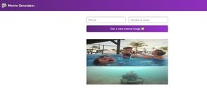
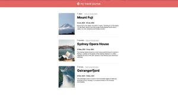
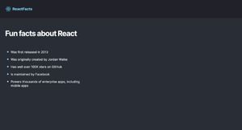
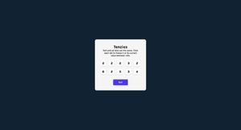

# Scrimba Projects

Language: 
  
  

## Projetos desafios do Scrimba

    <table>
    <thead>
        <tr>
            <th align="center">
                 
                

                    <small>#</small>
                

            </th>
            <th align="center">
                 
                
 
                    <small>NOME</small>
                

            </th>
            <th align="left">
                
                
 
                    <small>DATA DE LANÇAMENTO</small>
                

            </th>
            <th align="center">
                
                
 
                    <small>IMAGEM</small>
                

            </th>
        </tr>
    </thead>
    <tbody>
        <tr>
            <td>01</td>
            <td><a href="./businessCard">Carta de serviço</a></td>
            <td>21/09/2022 às 20:10</td>
            <td align="center">
            </td>
        </tr>
        <tr>
            <td>02</td>
            <td><a href="./memeGenerator">Gerador de memes!</a></td>
            <td>23/09/2022 às 14:09</td>
            <td align="center">
            </td>
        </tr>
        <tr>
            <td>03</td>
            <td><a href="./myTravelJournal">My Travel Journey!</a></td>
            <td>24/09/2022 às 13:07</td>
            <td align="center">
            </td>
        </tr>
        <tr>
            <td>04</td>
            <td><a href="./React-Project">Projeto de React</a></td>
            <td>25/09/2022 às 23:42</td>
            <td align="center">
            </td>
        </tr>
        <tr>
            <td>05</td>
            <td><a href="./tenzies">Tenzies</a></td>
            <td>30/09/2022 às 23:42</td>
            <td align="center">
            </td>
        </tr>
    </tbody>
</table>
 

## Scrimba Challenge Projects

    <table>
    <thead>
        <tr>
            <th align="center">
                 
                

                    <small>#</small>
                

            </th>
            <th align="center">
                 
                
 
                    <small>NAME</small>
                

            </th>
            <th align="left">
                
                
 
                    <small>RELEASE DATE</small>
                

            </th>
            <th align="center">
                
                
 
                    <small>PREVIEW</small>
                

            </th>
        </tr>
    </thead>
    <tbody>
        <tr>
            <td>01</td>
            <td><a href="./businessCard">Business Card</a></td>
            <td>21/09/2022 at 08:10PM</td>
            <td align="center">
            </td>
        </tr>
        <tr>
            <td>02</td>
            <td><a href="./memeGenerator">Meme Generator!</a></td>
            <td>23/09/2022 at 02:09PM</td>
            <td align="center">
            </td>
        </tr>
        <tr>
            <td>03</td>
            <td><a href="./myTravelJournal">My Travel Journey!</a></td>
            <td>24/09/2022 at 01:07PM</td>
            <td align="center">
            </td>
        </tr>
        <tr>
            <td>04</td>
            <td><a href="./React-Project">React Project</a></td>
            <td>25/09/2022 at 10:24PM</td>
            <td align="center">
            </td>
        </tr>
        <tr>
            <td>05</td>
            <td><a href="./tenzies">Tenzies</a></td>
            <td>30/09/2022 at 11:42PM</td>
            <td align="center">
            </td>
        </tr>
    </tbody>
</table>
