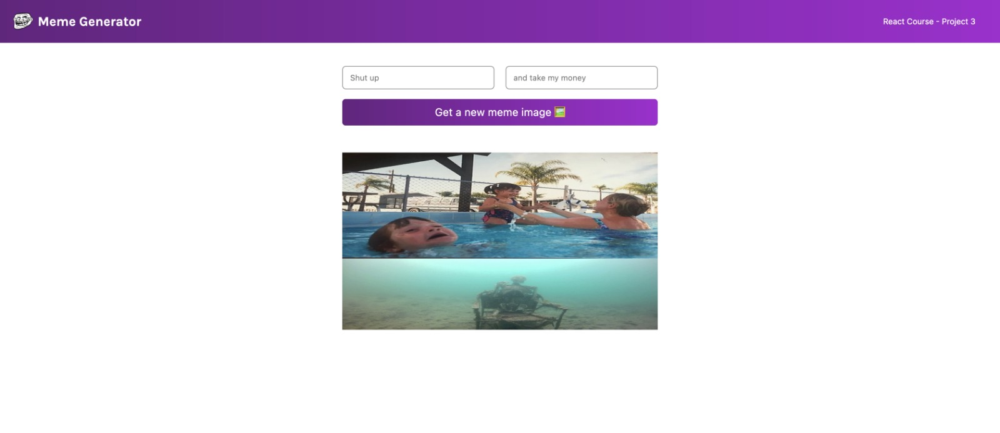

# Meme Generator

Language: 
  
  

Coding Language/Framework: 
  
  
  
   
  
  
  

Tools: 
  
  
  

  

## Descrição

Olá à todos! Este foi um dos projetos mais esperados (na minha opinião), e o mais relevante de todos! Não apenas por utilizar APIs do exterior, mas por sua simplicidade divertida!

## Description

Hi there! This was one of my most waited projects while studying (imo anyways), and the most relevant as well! Not only for utilizing external APIs, but for its funny simplicity!
