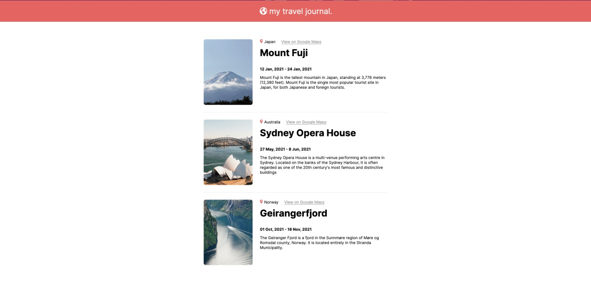

# My Travel Journey

Language: 
  
  

Coding Language/Framework: 
  
  
  
   
  
  

Tools: 
  
  
  

  

## Descrição

Olá à todos! Este em contra partida, foi um dos mais direto, buscando estudar props e como interagem de componente à componente, utilizei desde projeto realizado em aula.

## Description

Hi there! This on the other hand, was pretty straight foward, while searching to study props and their interactions on a component basis, I utilized this project developed between classes.
